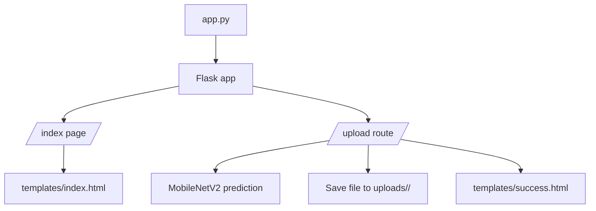
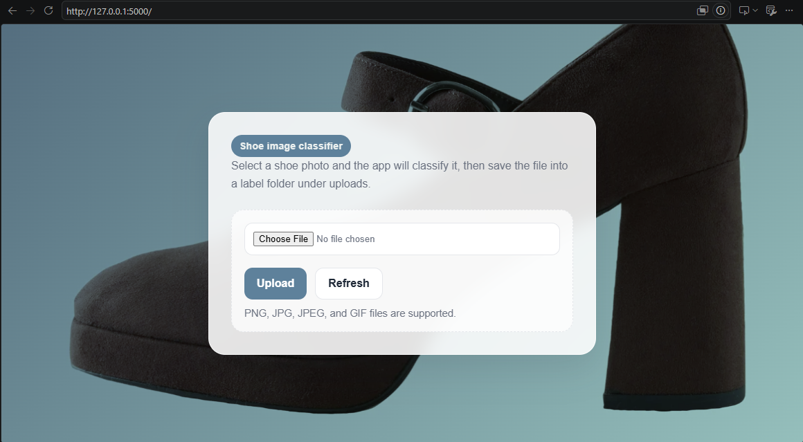
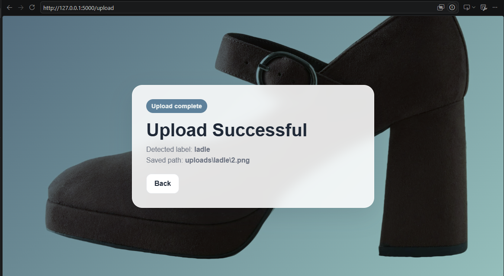
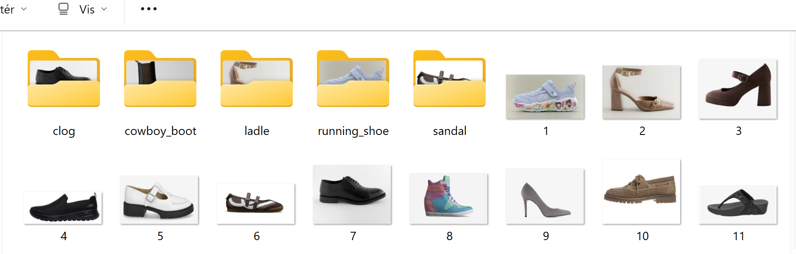

# Projekt2

An image upload web app built with Flask and TensorFlow. Users can upload a shoe image, the app runs a MobileNetV2 prediction, and the uploaded file is saved into a label-named folder under `uploads/`.

## Features

- Flask web server with a simple upload form
- Image classification using TensorFlow MobileNetV2 with ImageNet weights
- Automatic saving of uploaded images into predicted-label folders
- Simple success page showing the detected label and saved path

## Requirements

- Python 3.10 or newer
- `flask`
- `tensorflow`
- `pillow`
- `numpy`
- `requests` for the sample request script

## Setup

1. Create and activate a virtual environment.
2. Install the dependencies:

```bash
pip install flask tensorflow pillow numpy requests
```

## Run the app

Start the Flask server:

```bash
python app.py
```

Then open:

```text
http://localhost:5000
```

## How it works

- The home page shows an image upload form.
- Uploaded files are sent to the `/upload` route.
- The app resizes each image to `224x224`, preprocesses it, and runs MobileNetV2 prediction.
- The file is saved under `uploads/<predicted_label>/`.

## Sample scripts

- `test_ai.py` runs a local prediction against `uploads/test_2.png`.
- `test_request.py` sends a file upload request to `http://localhost:5000/upload`.

## Project structure

```text
app.py
test_ai.py
test_request.py
templates/
  index.html
  success.html
uploads/
```



## Finished Look

### Upload Page



### Success Page



### Classify Preview



## Notes

- The app currently uses a pretrained ImageNet model, so labels may not always match shoe categories exactly.
- Uploaded files are grouped by the predicted label, creating folders automatically when needed.

## License

This project is licensed under the MIT License. See [MIT License](license/LICENSE) for details.
